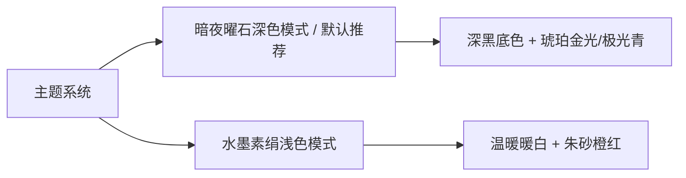
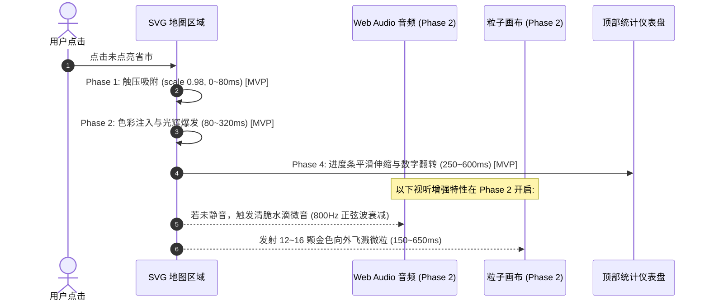
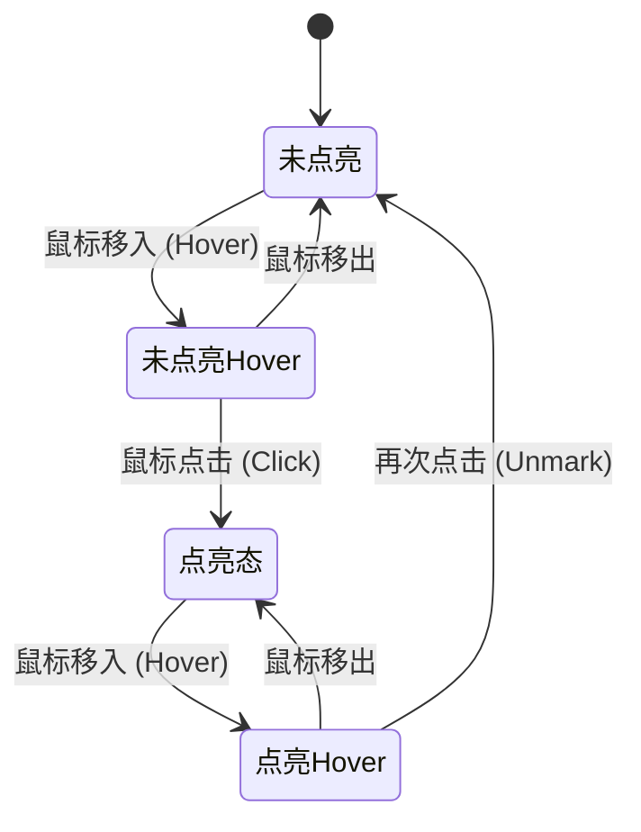
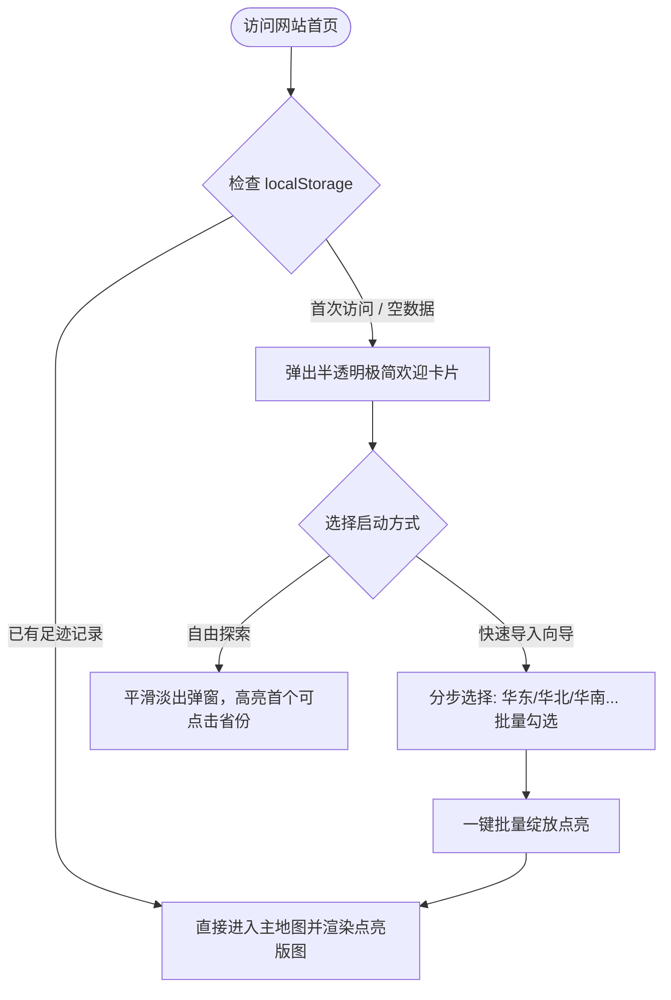
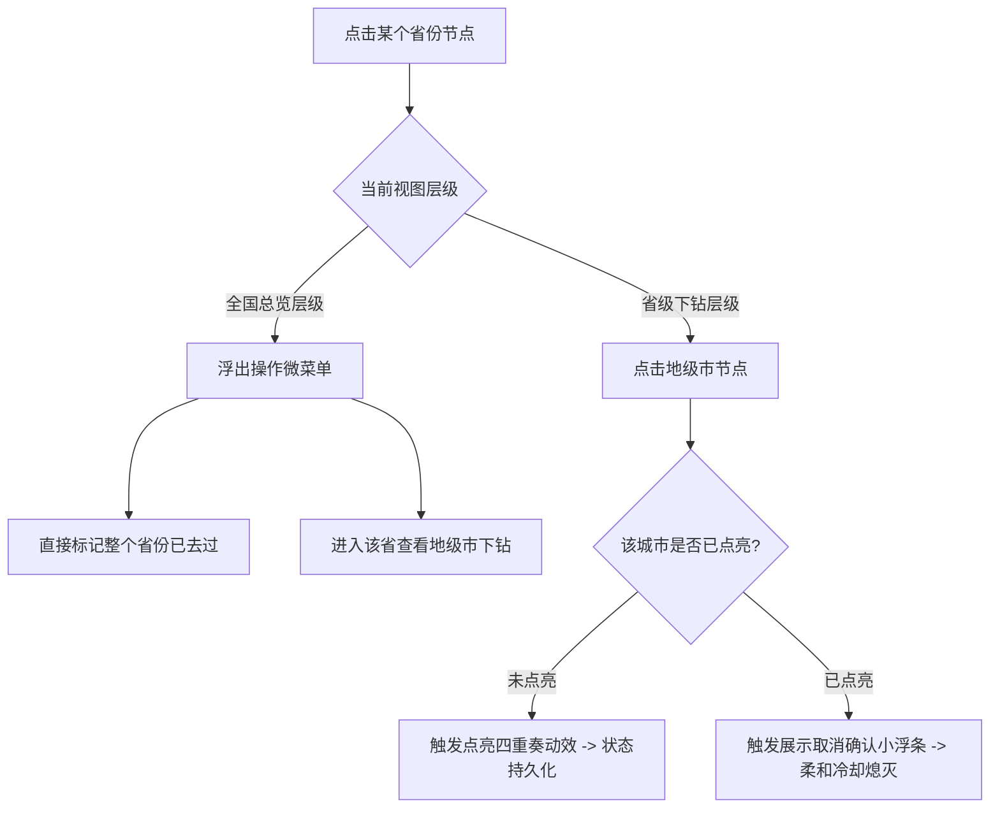
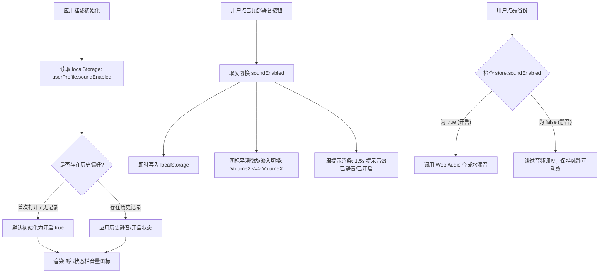
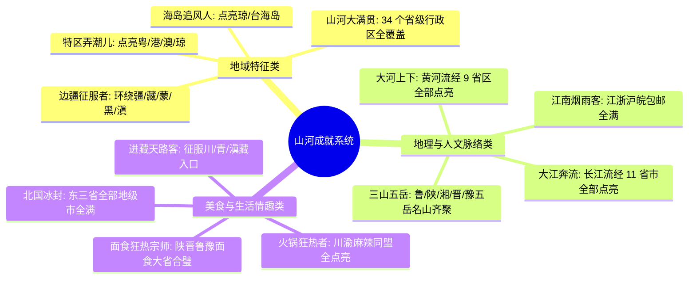
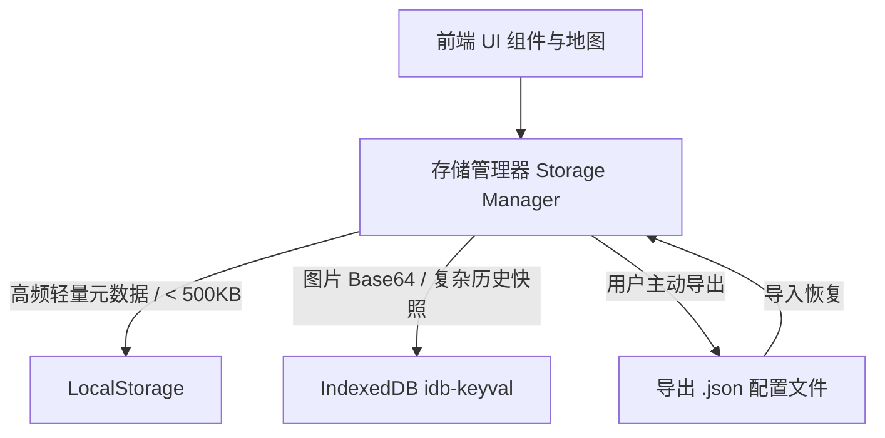
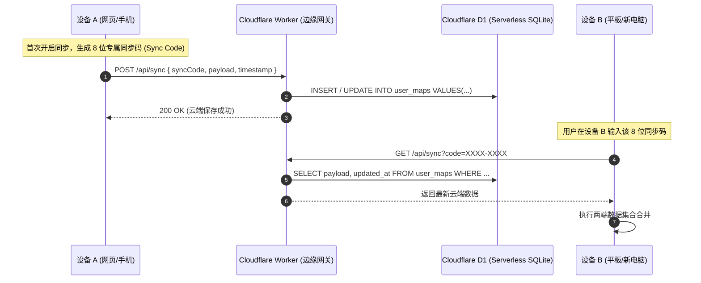
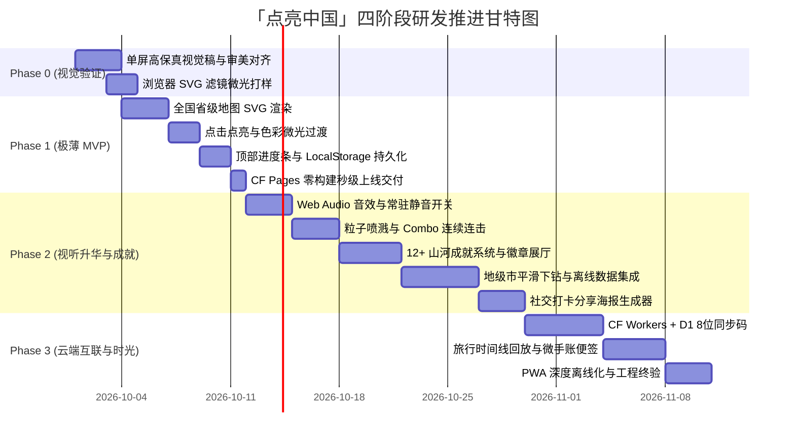

# 「点亮中国」（Footprint China）产品设计与前端架构方案文档

---

## 1. 产品定位与一句话介绍

### 1.1 产品定位
一款极致纯净、轻量美观、强反馈感的个人足迹地图与旅行成就收集 Web 应用。通过微交互动效与视觉仪式感，将用户的真实旅行经历具象化为一幅不断被“点亮”的个人数字国土版图。

### 1.2 一句话介绍
> “每一次出发都算数，用光芒重新度量你走过的山河。”

### 1.3 暂定名备选方案及命名理由

| 备选名称 | 英文标识 | 命名理由与意象 | 推荐指数 |
| :--- | :--- | :--- | :--- |
| **点亮中国** (当前暂定) | *LightUp China* | **动词驱动，直观纯粹**。直击产品最核心的交互动作“点亮”，传递由暗到明、由点及面的扩张感与收集欲，极易形成口口相传的认知心智。 | ★★★★★ |
| **山河志** | *GeoChronicle* | **人文底蕴，岁月沉淀**。取自中国古典方志典籍意向，强调“个人行走史”，削弱纯工具感，强化个人珍藏与时光记录的厚重感，适合偏好文艺与纪实风格的用户。 | ★★★★☆ |
| **足迹星图** | *ChinaPulse / Footprint Canvas* | **视觉通感，浪漫极客**。将 34 个省级行政区、300 余座城市隐喻为夜空中的暗星，用户的足迹如同星光被逐一点亮，契合暗黑模式下的璀璨光晕视觉体验。 | ★★★★☆ |

---

## 2. 目标用户与核心使用场景

### 2.1 目标用户画像
1. **重度旅行家 / 户外驴友 / 特种兵大学生**：具备极强的目的地收集癖与打卡欲，热衷于在社交平台展示旅行版图。
2. **高频出差商旅人士**：常年穿梭于各省会与枢纽城市，需要一个快速、自动汇总“飞行航迹与差旅足迹”的极简载体。
3. **地理与视觉审美爱好者**：对界面质感、排版留白、地图精度有严苛审美要求，厌恶繁杂广告与笨重社交 App。
4. **旅行规划者 / 伴侣家庭**：共同整理两人或家庭共同走过的城市，并以此梳理“下一站旅行心愿单”。

### 2.2 核心使用场景

#### 场景一：旅程归来后的“仪式感点亮”
- **用户**：小林，刚刚结束 5 天的川西甘孜与成都之旅，回到住处。
- **行为**：在手机或笔记本上打开网页，点击“四川省”，下钻进入地级市视图，逐一点亮“成都市”与“甘孜藏族自治州”。
- **体验感受**：伴随着清脆的蜂鸣音效与金光粒子在屏幕上喷溅，全国点亮进度跃升至 28.5%，系统弹出成就徽章「天府之国探索者」。小林感到旅途的疲惫被即时转化为数字资产的满足感。

#### 场景二：深夜整理回忆的“足迹考古”
- **用户**：老张，30 岁，夜晚坐在电脑前翻看相册，突然想梳理大学至今走过的地方。
- **行为**：进入网站开启“快速向导”，按照华北、华东、华南区域逐一回忆并快速勾选自己生活、读书、旅行过的省市。
- **体验感受**：地图从大片沉寂的暗色被一处处唤醒，看着连成一片的东南沿海，直观感受到自己十年来的人生轨迹，沉浸感强烈。

#### 场景三：社交平台的“凡尔赛海报”分享
- **用户**：阿雅，旅行博主，在完成了拉萨之行后达成了“西藏自治区全境点亮”。
- **行为**：点击顶部导航栏的“生成足迹卡片”，选择极简暗黑拍立得风格，自定义标语“人生清单完成 1/3”，一键生成高清 3:4 比例无水印图片。
- **体验感受**：发布至小红书与微信朋友圈，朋友纷纷询问“这是什么神仙网站，我也要点亮”。

#### 场景四：基于“空白版图”的出行灵感激发
- **用户**：打算制定国庆假期的李明与伴侣。
- **行为**：打开地图切换到“心愿单模式”，发现大西北与东北边境依然是一片深邃的暗调，与已点亮的华东形成鲜明对照。
- **体验感受**：视觉上的“缺失感”自然激发了探索未知领域的欲望，直接促成他们将“新疆阿勒泰”加入下一趟旅行计划。

---

## 3. 视觉设计系统 (Visual Design System)

### 3.1 整体风格定位
- **设计哲学**：**“新中式极简 + 现代微光拟态” (Zen Minimalism with Bioluminescence)**。
- **视觉特征**：拒绝廉价的高饱和度红黄配色；大面积留白与微透磨砂玻璃（Frosted Glass）；地图轮廓追求雕塑般的哑光质感；点亮状态赋予富有能量感的穿透光辉（Bloom Effect）与自然渐变。

### 3.2 完整配色方案（两套独立主题）



#### 3.2.1 深色模式 (Dark Obsidian Theme - 推荐默认)
营造深邃宇宙中点亮地表星火的史诗感。

| 语义角色 | 色值 (HEX / RGBA) | 视觉用途说明 |
| :--- | :--- | :--- |
| **画布背景 (Canvas)** | `#0B0F17` | 深邃夜空黑，微带极低饱和青蓝，消除纯黑眩光 |
| **表面容器 (Surface)** | `rgba(22, 27, 34, 0.75)` | 悬浮面板底色，配合 `backdrop-filter: blur(16px)` |
| **地图未点亮底色 (Map Inactive)** | `#181E29` | 哑光碳素深灰，低调内敛，具有沉睡感 |
| **地图未点亮描边 (Stroke Inactive)** | `#2A3342` | 极细几何分割线，保持地理轮廓辨识度 (0.75px) |
| **未点亮 Hover (Hover Inactive)** | `#252D3D` | 悬停即时反馈，灰度微亮 +10% |
| **点亮主色 (Accent Primary)** | `#FF8C38` | **落日落金**：核心点亮色彩，兼具温暖与穿透力 |
| **点亮渐变辅助色 (Accent Secondary)** | `#FFA959` | 用于点亮区域的径向渐变，形成中心光晕 |
| **点亮描边 (Stroke Active)** | `#FFE0B2` | 1px 高光边缘，强化立体浮雕感 |
| **点亮 Hover (Hover Active)** | `#FFA352` | 已点亮区域悬停时更亮更炽热 |
| **光晕投影 (Glow Drop-shadow)** | `rgba(255, 140, 56, 0.45)` | `drop-shadow(0 0 16px rgba(255,140,56,0.45))` |
| **文字主色 (Text Primary)** | `#F0F6FC` | 标题、主要数值、强对比阅读 |
| **文字次色 (Text Secondary)** | `#8B949E` | 辅助说明、未解锁成就标签 |
| **分割线与卡片边框 (Border)** | `rgba(255, 255, 255, 0.08)` | 1px 细微边界，精致现代感 |

#### 3.2.2 浅色模式 (Light Rice Paper Theme)
呈现东方宣纸水墨晕染与朱砂印章的典雅雅致感。

| 语义角色 | 色值 (HEX / RGBA) | 视觉用途说明 |
| :--- | :--- | :--- |
| **画布背景 (Canvas)** | `#F7F8FA` | 温润素雅暖白底，模拟天然米白纸质 |
| **表面容器 (Surface)** | `rgba(255, 255, 255, 0.85)` | 纯白磨砂半透卡片，搭配微柔内阴影 |
| **地图未点亮底色 (Map Inactive)** | `#E2E6EB` | 冷调素石灰，干净不夺目 |
| **地图未点亮描边 (Stroke Inactive)** | `#CBD2D9` | 边界线灰阶清晰柔和 |
| **未点亮 Hover (Hover Inactive)** | `#D5DC4` | 轻微提亮与悬浮感 |
| **点亮主色 (Accent Primary)** | `#E64A19` | **传统朱砂红**：沉稳典雅，象征印章印记 |
| **点亮渐变辅助色 (Accent Secondary)** | `#FF7043` | 渐变过渡色，边缘呈温润朱霞色 |
| **点亮描边 (Stroke Active)** | `#FFFFFF` | 纯白清晰分界线 (1px) |
| **点亮 Hover (Hover Active)** | `#D84315` | 加深朱砂饱和度 |
| **光晕投影 (Glow Drop-shadow)** | `rgba(230, 74, 25, 0.25)` | 柔和弥散阴影 |
| **文字主色 (Text Primary)** | `#191F28` | 深黑蓝，高可读性正文 |
| **文字次色 (Text Secondary)** | `#6B7684` | 优雅次级灰 |
| **分割线与卡片边框 (Border)** | `#E5E8EB` | 浅色基底分界线 |

### 3.3 字体方案 (Typography)
- **中文字体栈**：优先调用各操作系统优质无衬线系统字体，兼顾字重层次与渲染锐度：
  ```css
  font-family: -apple-system, BlinkMacSystemFont, "PingFang SC", "Hiragino Sans GB",
               "MiSans", "HarmonyOS Sans SC", "Microsoft YaHei", "Noto Sans SC", sans-serif;
  ```
- **英文字符与统计数字 (Monospace / Display Numerics)**：
  - 数字展现是该产品的核心心理刺激源，选用具有现代感与等宽特性的西文字体：
  - 首选：`"JetBrains Mono"`, `"DIN Alternate"`, `"SF Pro Display"`, `system-ui`。
- **字阶与排版规范**：
  - **Hero Display** (成就率 / 大数字)：`44px / line-height: 1.1 / font-weight: 700 / tracking: -0.02em`
  - **Title H1** (一级模块 / 模态弹窗)：`24px / line-height: 1.3 / font-weight: 600`
  - **Title H2** (卡片标题 / 省份名称)：`18px / line-height: 1.4 / font-weight: 600`
  - **Body Regular** (正文 / 提示文案)：`14px / line-height: 1.5 / font-weight: 400`
  - **Caption Tiny** (徽章角标 / 地图辅助注记)：`11px / line-height: 1.4 / font-weight: 500 / tracking: 0.05em`

### 3.4 “点亮”动效设计细节（产品的灵魂）



1. **悬停态反馈 (Hover State)**：
   - 交互曲线：`cubic-bezier(0.2, 0.8, 0.2, 1)`，持续 `200ms`。
   - 地图多边形：微浮起（`transform: translateY(-1px)`），边缘描边高亮度 +20%，产生可点击的光感预警。
   - 悬浮跟随标签 (Smart Tooltip)：鼠标旁跟随呈现精致半透明药丸胶囊，清晰展示“省份名称”、“未去过/已点亮”状态。
2. **点亮瞬间动效 (Activation Feedback - 研发分期与微时序分解)**：
   - **Phase 1 [0ms ~ 80ms] 物理触压 (MVP 核心)**：多边形整体轻微微缩放至 `scale(0.98)`，触控设备触发极短微震（`navigator.vibrate(12)`）。
   - **Phase 2 [80ms ~ 320ms] 冲击波与能量光环 (MVP 核心)**：多边形填充色在 `240ms` 内从哑光暗灰（`#181E29`）经由高亮白金（`#FFF3E0`）瞬态闪耀，最终沉淀为琥珀落日落金（`#FF8C38`）。同时，SVG 外部激活 `drop-shadow(0 0 20px rgba(255,140,56,0.7))` 脉冲，随后平缓回落至稳定的 `8px` 呼吸辉光。
   - **Phase 3 [150ms ~ 650ms] 繁星粒子爆裂 (Phase 2 交付)**：以点击坐标为原点，Canvas 粒子引擎喷射 12~16 颗极小微米级星火微粒，带有随机初始速度、重力衰减与旋转，在 500ms 内向外扩散消散。MVP 阶段暂不挂载粒子层，保持渲染管线极简。
   - **Phase 4 [250ms ~ 600ms] 仪表盘联动 (MVP 核心)**：顶部与侧边的统计数字（如 `1/34`、`2.9%`）平滑滚动更新，进度条掠过一束平滑延展的微光。
3. **取消点亮反馈 (Extinguish Feedback - MVP 核心)**：
   - 绝非机械的“瞬间变黑”，而是拟真**“余烬冷却” (Cooling Ember)** 过程。
   - 持续时长：`320ms`。
   - 表现：辉光光晕在 120ms 内迅速收束，饱和度逐渐褪去（`saturate(1) -> saturate(0)`），颜色从温热橙黄渐变为冷灰，伴随柔和的轻微阻尼回弹，避免误触时的突兀失落感。

#### 3.4.1 音效反馈与常驻静音开关控制规范 (Phase 2 进阶系统)
点亮音效能提供极强的仪式感，但连续高频点亮（如连续勾选 20 个省份）极易引发听觉疲劳。因此系统建立完善的音效与静音控制规范：
- **默认状态**：音效**默认开启**（`soundEnabled: true`），首次使用即提供最佳多模态视听反馈。
- **界面常驻静音开关**：
  - **位置与形态**：固定常驻于顶部全局状态栏右上角（紧邻主题切换按钮），采用精致半透明磨砂胶囊设计（`backdrop-filter: blur(12px)`）。
  - **图标与状态指示**：使用标准音量图标（开启态：`Volume2`，带有微光光晕；静音态：`VolumeX`，呈现低对比度次级灰，一目了然）。
  - **交互体验**：单次点击即时切换，无弹窗打扰；切换时伴随微动效提示（如 1.5 秒淡入淡出的微气泡提示“已静音”或“音效已开启”）。
- **用户偏好持久化**：
  - 用户的静音状态实时写入 `localStorage`（配置项路径：`userProfile.soundEnabled`）。
  - 页面初次加载时优先读取该项设置，跨会话或刷新后 100% 保持用户的静音选择，绝不重复强行开启。
- **听觉防疲劳声学优化**：
  - 采用轻量 Web Audio API 合成温润的水滴木石音（基频 800Hz，正弦波叠加轻微低通滤波），峰值音量限制在安全电平 `-16dB`，尾音在 `180ms` 内指数衰减，避免刺耳高频。

---

## 4. 地图方案与 GeoJSON 数据集成

### 4.1 技术实现路线对比与架构结论

为支撑高质感动效与极小加载开销，对业界主流的 3 种地图实现路线进行技术评估：

| 评估维度 | 方案 A: 纯 SVG 驱动 (D3-geo 投影) | 方案 B: ECharts 5 地图组件 | 方案 C: Canvas / WebGL (MapLibre/Deck.gl) |
| :--- | :--- | :--- | :--- |
| **运行时包体积 (Bundle Size)** | **极小**：`d3-geo` 仅需 ~18KB (Gzip)，零多余黑盒依赖 | **中偏大**：核心 + 地图扩展按需约 ~350KB+ | **庞大**：WebGL 引擎约 ~600KB - 1MB+ |
| **微交互与 CSS 深度控制** | **极致**：每个省/市为原生 DOM `<path>`，完全支持 CSS 滤镜、渐变、Drop-shadow、Tailwind 类名 | **受限**：受制于 Canvas 绘制上下文，无法直接使用原生 CSS 类、滤镜与复杂 DOM 动效 | **复杂**：需通过着色器 (Shader) 或帧动画自行编写图形管线，成本极高 |
| **两级平滑下钻体验** | **平滑流畅**：通过 SVG `viewBox` 平滑插值动画（Spring Animation），无缝过渡下钻 | **生硬**：通常通过清空重绘或 `setOption` 重新加载，难以实现连贯缩放镜头 | **流畅**：具备相机缩放特性，但开发与坐标对齐复杂度极高 |
| **静态部署适用性 (CF Pages)** | **完美**：纯静态资源，无任何 WebGL 兼容性陷阱 | **良好**：通用静态打包 | **一般**：低端移动端存在 WebGL 崩溃及内存占用风险 |
| **触控与无障碍友好度** | **高**：每个 `<path>` 均可挂载 `aria-label`、指针手势 | **中**：由 Canvas 内部拾取模拟计算 | **低**：完全自制拾取层 |

#### 架构结论
**选用「方案 A：纯 SVG 驱动 (结合 d3-geo 坐标投影计算)」作为核心路线**。
- **原因**：本项目为“艺术展示与情感收集”产品，而非 GIS 地理信息测绘工具。全国仅 34 个省级节点，省内下钻仅 10~21 个地级市节点，DOM 节点数量极少（远低于 DOM 性能临界点 1500 节点）。SVG 能赋予我们对每一根路径、每一次发光、每一道渐变的绝对像素级控制力。

### 4.2 GeoJSON 数据源、跨域实测与容灾兜底架构

#### 4.2.1 权威合规数据源与 CORS 跨域实测验证
中国地图具有高度严肃的法定规范，必须严格采用官方审图号规范、完整包含南海诸岛、十段线、钓鱼岛及其附属岛屿的正规数据。
本项目数据源选用**阿里云 DataV 官方高德数据服务（全国标准 Adcode 拓扑源）**。

针对浏览器端直接 `fetch` 该接口是否存在跨域拦截风险，评审人提出严格实测要求。我们于本地终端执行标准 CORS 预检与跨域抓包验证（实测时间：2026-09-29）：

```bash
# 验证全国总览边界跨域响应头
curl -I -s -H "Origin: https://footprint-china.pages.dev" \
  "https://geo.datav.aliyun.com/areas_v3/bound/100000_full.json"

# 验证地级市下钻数据跨域响应头 (以广东省 440000 为例)
curl -I -s -H "Origin: https://footprint-china.pages.dev" \
  "https://geo.datav.aliyun.com/areas_v3/bound/440000_full.json"
```

**实测响应头截取结果**：
```http
HTTP/1.1 200 OK
Server: Tengine
Content-Type: application/json
Timing-Allow-Origin: *
Access-Control-Allow-Origin: *
x-oss-cdn-auth: success
Content-MD5: tmGO9FyibjxmqxSaxfHozA==
X-Cache: HIT TCP_MEM_HIT dirn:-2:-2
Content-Length: 192961
```

**实测结论**：
1. **天然支持跨域**：阿里云 DataV 明确返回了 `Access-Control-Allow-Origin: *` 与 `Timing-Allow-Origin: *`，现阶段前端页面直接通过原生 `fetch()` 跨域请求完全畅通，不存在跨域安全拦截阻断。
2. **CDN 边缘高命中**：响应头包含 `X-Cache: HIT TCP_MEM_HIT`，接口具有高频 CDN 缓存。

#### 4.2.2 跨域与可用性 Fallback 兜底方案（应对第三方不可控风险）
尽管实测连通且支持 CORS，但该域名属于阿里云 DataV 产品的内部支撑资产，**并无面向公网开发者的商业 SLA 协议保障**。若未来阿里收紧防盗链白名单、限制请求频次或变更接口路径，纯线上拉取将导致地级市下钻功能整体瘫痪。为此，必须设计两套生产级兜底架构：

```mermaid
graph TD
    UserReq[用户点击下钻地级市] --> Route{资源请求路由}
    Route -->|首选方案 A (推荐)| LocalAsset[本地静态资源 /maps/cities/{adcode}.json]
    LocalAsset --> CFPagesCDN[Cloudflare Pages 全球边缘 Anycast 分发]
    CFPagesCDN --> FastRender[零延迟秒开渲染 / 100% 确定性]
    
    Route -.->|备选方案 B| WorkerProxy[Cloudflare Worker 反向代理]
    WorkerProxy -->|边缘转发| AliOrigin[阿里云 DataV 源站]
    WorkerProxy -->|注入 CORS & 边缘缓存| BrowserClient[前端浏览器]
```

- **方案 A：全量打包至本地静态目录（推荐）**
  - **实现方式**：在开发阶段，编写极简爬取脚本将全国 34 个省级行政区下辖地级市 GeoJSON 一次性拉取到项目本地 `/public/maps/cities/{adcode}.json`，并通过 `Mapshaper` CLI 进行无损拓扑精简（剔除无用冗余属性，保留 0.001 级几何精度）。
  - **体积与首屏影响评估**：
    - *静态包总大小*：全国 34 个地级市 GeoJSON 优化后原始体积合计约 **8.2 MB**，经 Gzip/Brotli 压缩后总计仅约 **1.8 MB**。
    - *首屏影响*：**对首屏加载影响为 0 KB**。首屏仅按需加载全国省级基础版图 `china.json`（压缩后仅 ~118 KB）。34 个省份的地级市文件全部分割存储，仅当用户下钻该省时才按需异步拉取对应的单个文件（每个仅 35~80 KB Gzip）。
    - *优势*：彻底消除单点故障风险；与 Cloudflare Pages 静态部署完美契合；享受全球 CDN 强缓存（`Cache-Control: immutable`）；断网/飞行模式下亦可依托 Service Worker 实现 100% 离线运行。
- **方案 B：Cloudflare Worker 边缘轻量反向代理**
  - **配置思路**：部署一段极简 Cloudflare Worker（挂载路由 `/api/geo/:adcode`），代码逻辑如下：
    ```javascript
    export default {
      async fetch(request, env) {
        const url = new URL(request.url);
        const adcode = url.pathname.split('/').pop();
        const targetUrl = `https://geo.datav.aliyun.com/areas_v3/bound/${adcode}_full.json`;
        const cache = caches.default;
        let response = await cache.match(request);
        if (!response) {
          const originRes = await fetch(targetUrl);
          response = new Response(originRes.body, originRes);
          response.headers.set('Access-Control-Allow-Origin', '*');
          response.headers.set('Cache-Control', 'public, max-age=2592000, s-maxage=31536000');
          await cache.put(request, response.clone());
        }
        return response;
      }
    };
    ```
  - *优劣势*：不增加本地静态仓库体积；但若上游源站彻底关停或封禁，该代理仍将面临不可用。
- **最终架构决选**：
  **明确推荐「方案 A：全量打包至本地静态目录」作为标准交付方案**。地理边界信息属于数年不变的极低频变动数据，一次打包自托管能够赋予应用长达数十年的生命周期自闭环，完全契合个人独立站“长青、免运维”的核心价值。

### 4.3 未点亮 vs 点亮 vs Hover 三态视觉区分规范



| 状态维度 | 未点亮态 (Inactive) | 点亮态 (Active) | 悬停态 (Hover) |
| :--- | :--- | :--- | :--- |
| **填充表现** | 哑光碳素深灰 (`#181E29`) | 琥珀金光径向渐变 (`#FF8C38` -> `#FFA959`) | 亮度增益 `filter: brightness(1.15)` |
| **描边线宽** | `0.75px` 细线 (`#2A3342`) | `1.2px` 纯净高光边 (`#FFE0B2`) | `1.5px` 动态吸附强化边框 |
| **光晕特效** | 无 (filter: none) | `filter: drop-shadow(0 0 10px rgba(255,140,56,0.5))` | 光晕半径临时扩散至 `14px` |
| **Z 轴深度** | 基底平铺层 (z-index: 1) | 高亮层，提升渲染层级 (z-index: 5) | 顶层悬浮 (z-index: 10, 微移) |
| **注记文本** | 低对比度微光文字 (`#8B949E`) | 纯白高对比度文字 (`#FFFFFF`, 加粗带阴影) | 浮出微型状态气泡 (Tooltip) |

#### 特殊状态：省份“部分点亮 (Partial Active)”
- **应用场景**：在全国总览视图下，若用户已点亮该省下辖的“成都市”，但尚未走遍四川其他地级市。
- **视觉呈现**：省份底色呈现 `40%` 透明度的琥珀点亮色，叠加微细的 `45度` 斜向微光发光条纹（SVG Pattern），右侧注记显示小胶囊“1/21”，既彰显已解锁足迹，又强烈召唤用户“去把它彻底点亮”。

---

## 5. 核心交互流程设计

### 5.1 首次进入引导流程 (First-time Onboarding)



- **设计克制**：拒绝多步弹窗打扰。首次进入页面，地图以 1.2 秒的柔和淡入动画呈现，背景带有微微脉动的微光。
- **微交互线索**：若无数据，地图右上角显示极简呼吸提示条：“点击任意省份，点亮你的第一枚山河印记”。

### 5.2 标记与取消标记交互流程 (Mark / Unmark Flow)



- **防误触机制**：
  - 点击未标记区域：**单次点击直接点亮**，确保即时正反馈的快感最大化。
  - 点击已标记区域：弹出原地极简气泡：“已点亮 · [取消标记] · [添加旅行记忆]”，需点击“取消标记”才熄灭，防止误触导致数据清空。

### 5.3 层级下钻与镜头平滑过渡 (Drill-down & Breadcrumb - Phase 2)
1. **下钻动作**：点击省份浮卡中的“探索城市”或双击省份，视图激活平滑下钻。
2. **镜头动画**：
   - 使用 D3-geo 计算该省多边形的几何边界包围盒（Bounding Box）。
   - 将主 SVG 的 `viewBox` 坐标通过阻尼插值过渡到该包围盒，配合平滑缩放聚焦。
   - 其他省份以 `0.2` 透明度逐渐隐入背景，该省的地级市 SVG 边界以淡入扩散模式呈现。
3. **面包屑定位**：
   - 地图左上角常驻半透毛玻璃面包屑：`中国 > 四川省 (已亮 3/21)`。
   - 点击“中国”或点击地图外空白暗区，镜头即刻平滑拉升，无缝还原为全国大版图。

### 5.4 全局静音与音频控制交互链路 (Phase 2 进阶系统)



- **交互体验核心原则**：
  - **绝不打断操作**：切换静音为顶栏单点即改，不阻断主画布的浏览与缩放。
  - **状态绝对记忆**：无论何时刷新或重开网页，用户静音意图严格保真。
  - **视觉状态同构**：按钮图标高亮与否（琥珀微光 vs 暗色无光）与真实音频管道开关严密绑定。

---

## 6. 点亮机制与成就系统

### 6.1 全国进度计算与多维量化模型
产品不仅提供粗暴的百分比，更设计了 3 组令用户自豪的量化指标：
1. **省级覆盖率**：$\frac{已点亮省份数}{34} \times 100\%$ （主直观指标）。
2. **城市覆盖率**：$\frac{已点亮地级市数}{371} \times 100\%$ （特种兵深度指标）。
3. **国土版图面积加权 (趣味算法)**：
   - 将新疆（约 166 万 km²）、西藏（约 122 万 km²）、内蒙古（约 118 万 km²）等广袤省份赋予实际几何面积权重。
   - 用户一旦点亮新疆或西藏，面积覆盖率瞬间飙升 10%~17%，带来极具冲击力的视觉心理震撼。

### 6.2 阶梯式等级与称号体系

| 等级序号 | 称号名称 | 解锁条件 (满足任一) | 视觉徽章特征 |
| :---: | :---: | :---: | :---: |
| **Lv.1** | **初见山海** | 点亮 1 个省份 | 朴素铜质微光徽章 |
| **Lv.2** | **行者初程** | 点亮 3 个省份 | 银质清辉徽章 |
| **Lv.3** | **走南闯北** | 点亮 6 个省份 | 曜石黑金微雕徽章 |
| **Lv.4** | **寻味九州** | 点亮 10 个省份 | 琥珀流光徽章 |
| **Lv.5** | **阅尽千山** | 点亮 16 个省份 | 翡翠华彩徽章 |
| **Lv.6** | **河山胜客** | 点亮 23 个省份 | 紫晶天工徽章 |
| **Lv.7** | **九州巡抚** | 点亮 30 个省份 | 钛金耀斑徽章（带流转光带） |
| **Lv.8** | **山河大满贯** | 点亮全部 34 个省级行政区 | 传奇炽金·动态全息旋转星盘徽章 |

### 6.3 12 个特色深度成就设计（含梗与文化积淀）



1. 🏆 **「山河大满贯」**
   - *解锁条件*：点亮全部 34 个省级行政单位（含港澳台）。
   - *文案*：*“九百六十万平方公里的苍茫大地上，每一寸山河都有你的足印。”*
2. 🦅 **「边疆征服者」**
   - *解锁条件*：点亮新疆、西藏、内蒙古、黑龙江、云南（祖国主要陆地沿边省区）。
   - *文案*：*“从祖国西极到北极村，你将边界线走成了心中的勋章。”*
3. 🥟 **「江南烟雨客」**
   - *解锁条件*：江浙沪皖（泛长三角四省市）全部点亮。
   - *文案*：*“沾衣欲湿杏花雨，吹面不寒杨柳风。包邮区被你摸得透透的。”*
4. 🌶️ **「火锅狂热者」**
   - *解锁条件*：四川省与重庆市全部点亮。
   - *文案*：*“空气里都是牛油香与藤椒味，巴蜀双子星已被你的胃征服。”*
5. 🌊 **「大河上下」**
   - *解锁条件*：黄河流经的 9 省区（青、川、甘、宁、蒙、陕、晋、豫、鲁）全部点亮。
   - *文案*：*“黄河落天走东海，万里写入胸怀间。”*
6. 🚢 **「大江奔流」**
   - *解锁条件*：长江干流流经的 11 省区市（青、藏、川、滇、渝、鄂、湘、赣、皖、苏、沪）全部点亮。
   - *文案*：*“孤帆远影碧空尽，万里长江横渡人。”*
7. ⛰️ **「三山五岳」**
   - *解锁条件*：泰山(山东)、华山(陕西)、衡山(湖南)、恒山(山西)、嵩山(河南) 所在省份全部点亮。
   - *文案*：*“五岳归来不看山，天下名山皆为我友。”*
8. 🏙️ **「特区弄潮儿」**
   - *解锁条件*：广东省、香港特别行政区、澳门特别行政区、海南省全部点亮。
   - *文案*：*“站在时代的潮头，大湾区与自贸港的阳光晒黑了你的臂弯。”*
9. 🏔️ **「进藏天路客」**
   - *解锁条件*：点亮西藏，且同时点亮青海、四川、云南中的至少两个。
   - *文案*：*“无论是川藏线、青藏线还是滇藏线，雪山洗涤了你的灵魂。”*
10. 🥥 **「海岛追风人」**
    - *解锁条件*：海南省与台湾省全部点亮。
    - *文案*：*“双岛碧浪，踏浪听涛，祖国两大宝岛皆留下你的笑语。”*
11. 🍜 **「面食大宗师」**
    - *解锁条件*：陕西省、山西省、河南省、山东省全部点亮。
    - *文案*：*“油泼面、刀削面、烩面、拉面，碳水的快乐你最懂。”*
12. ❄️ **「北国风光」**
    - *解锁条件*：黑龙江、吉林、辽宁三省所有地级市全部点亮（地级市深度成就）。
    - *文案*：*“千里冰封，万里雪飘，黑土地上的每一个角落都留下了你的体温。”*

### 6.4 连续点亮与“心流”激励机制 (Flow & Combo Incentive)
- **连击计数 (Combo Multiplier)**：当用户在 3 秒内连续点亮多个省份或城市时，界面右侧激活动态连击徽记：`Combo x2!`, `Combo x3! Awesome!`。
- **音效音调爬升**：通过 Web Audio API 合成音频，每一次连续点击使基准频率上升半音（800Hz -> 890Hz -> 1000Hz），模拟街机通关的连续爽快感。
- **阶段性礼花爆裂**：当跨越 10%、25%、50%、75%、100% 阈值节点时，屏幕四周触发全屏 Canvas 金色纸屑礼花雨（Confetti）。

---

## 7. 扩展功能规划

为了保持产品“纯净有呼吸感”的核心内核，所有扩展功能均以轻量浮层、抽屉或纯前端计算实现，拒绝臃肿堆砌：

1. **高颜值社交分享海报生成器 (Social Share Poster)**：
   - 纯前端（`html-to-image`）一键将当前点亮地图渲染导出为高清 PNG。
   - 提供 3 种版式模板：小红书 3:4 精致卡片、朋友圈 1:1 正方图、手机壁纸 9:16 全屏。
   - 自动生成极具美感的排版：包含个人昵称、点亮百分比、最远涉足坐标、当前最高成就徽章、极简专属 QR 码。
2. **深度足迹数据分析洞察 (Footprint Insights)**：
   - **四极之境**：智能计算用户走过的“最北之城”（如漠河）、“最南之境”（如三亚）、“最西之地”（如喀什）、“最高海拔”。
   - **地形穿梭比**：统计高原、平原、沿海城市的涉足比例。
3. **旅行心愿单模式 (Wanderlust Wishlist)**：
   - 支持一键切换“已去过”与“想去”两套图层。
   - “想去”的目标省市在地图上呈现如星光闪烁的梦幻浅紫色虚线光环，让地图成为未来的造梦空间。
4. **旅行时间线折叠轴 (Timeline Journey)**：
   - 用户可为点亮的省市选填年份或月份（如“2023年 秋”）。
   - 点击底部时间控制器，地图自动按时间轴演进“回放”用户的走南闯北史，仿佛一部个人纪录片。
5. **极简旅行手账便签 (Micro Travel Notes)**：
   - 下钻至地级市后，点击可记录一句话旅行短评（20 字以内）及 1 张拍立得缩略照片（采用客户端压缩存储至 IndexedDB）。
6. **无缝双端适配与 PWA 离线安装**：
   - 支持移动端捏合缩放（Pinch-to-zoom）与单手点击。
   - 配置完整 `manifest.json` 与 Service Worker，可直接“添加到手机主屏幕”，表现如原生 App 般丝滑。
7. **数据隐私与本地优先备份 (Local-First Backup)**：
   - 零注册门槛，尊重隐私，无任何追踪 Cookie。
   - 提供一键导出 `.json` 备份文件与一键恢复功能，换手机或清理浏览器缓存时轻松无缝迁移。

---

## 8. 数据持久化与多端同步架构

### 8.1 第一期：纯本地存储架构 (LocalStorage + IndexedDB)

由于第一期坚持 Cloudflare 纯静态托管、无后端服务器，所有用户状态均持久化于浏览器本地端。



#### LocalStorage JSON Schema 规范定义
键名规范：`footprint_china_v1_store`

```json
{
  "schemaVersion": "1.0.0",
  "lastUpdated": 1727616000000,
  "userProfile": {
    "nickname": "山河行者",
    "avatarPreset": "avatar_mountain_gold",
    "themePreference": "dark",
    "soundEnabled": true
  },
  "stats": {
    "totalProvinces": 34,
    "litProvincesCount": 12,
    "totalCities": 371,
    "litCitiesCount": 38,
    "coveragePercentage": 35.29
  },
  "litProvinces": {
    "110000": { "adcode": 110000, "name": "北京市", "litAt": 1698720000000, "isDirect": true },
    "440000": { "adcode": 440000, "name": "广东省", "litAt": 1704067200000, "isDirect": false }
  },
  "litCities": {
    "440100": { "adcode": 440100, "name": "广州市", "provinceAdcode": 440000, "litAt": 1704067200000, "notes": "喝早茶，登小蛮腰" },
    "440300": { "adcode": 440300, "name": "深圳市", "provinceAdcode": 440000, "litAt": 1704153600000, "notes": "深圳湾看夕阳" }
  },
  "wishlist": {
    "650000": { "adcode": 650000, "name": "新疆维吾尔自治区", "addedAt": 1727616000000 }
  },
  "unlockedAchievements": [
    { "id": "ach_first_step", "unlockedAt": 1698720000000 },
    { "id": "ach_lingnan_tide", "unlockedAt": 1704153600000 }
  ]
}
```

### 8.2 第二期：云端同步方案 (Cloudflare KV / D1 免费生态)

当产品演进至多端同步阶段，充分利用 Cloudflare 边缘计算免费额度（Workers: 100,000 次请求/天；KV: 100,000 次读/天，1,000 次写/天；D1: 500 万次读/天）：



#### 数据同步冲突解决策略 (Conflict-Resolution Strategy)
- **无账号极简同步**：不强制绑定手机号与微信，采用 NanoID 生成类似 `K8N2-9X4L` 的高熵 8 位**短同步凭证 (Sync Key)**。
- **并集优先合并 (Union-Merge / CRDT 思路)**：
  - 足迹本质上属于“单调累加”状态（去过就是去过，极少会出现把已去过的城市推翻清零的情况）。
  - 若设备 A 与设备 B 存在时间差冲突，同步引擎执行**集合并集 (Set Union)** 计算：
    $$LitCities_{Final} = LitCities_A \cup LitCities_B$$
  - 对于修改性字段（如同一城市的旅行手账文本），以时间戳为准采用 **最后写入者胜 (Last-Write-Wins, LWW)** 策略，确保用户数据永不丢失。

---

## 9. 页面信息架构与布局 (Information Architecture)

网站采用单页极简应用 (Single Page Application) 架构，主画布永远聚焦于地图本身，次级功能以平滑浮层交互呈现。

```mermaid
graph TD
    Root[网站主界面 index.html] --> TopNav[顶部悬浮状态栏 Header]
    Root --> MapCanvas[中央沉浸式地图画布 Map Canvas]
    Root --> FloatBar[快捷悬浮工具栏 Float Toolbar]
    Root --> Drawer[地级市快速检索抽屉 City Drawer (Phase 2)]
    Root --> Modals[弹窗体系 Modals System]

    TopNav --> NavStats[已点亮省份/城市胶囊进度 - MVP]
    TopNav --> NavMute[常驻一键静音/音效切换 - Phase 2]
    TopNav --> NavTheme[深/浅模式瞬态切换 - Phase 2]
    TopNav --> NavShare[生成精美分享海报 - Phase 2]
    TopNav --> NavAchieve[成就奖章墙入口 - Phase 2]

    MapCanvas --> SVGNational[全国省级 SVG 投影图层 - MVP]
    MapCanvas --> SVGProvincial[省级下钻地级市图层 - Phase 2]
    MapCanvas --> ParticleLayer[Canvas 粒子动效层 - Phase 2]
    MapCanvas --> TooltipLayer[跟随鼠标光标浮动气泡 - MVP]

    FloatBar --> ZoomControl[平移缩放还原按钮 - MVP]
    FloatBar --> ViewSwitch[全国 / 省级下钻一键返回 - Phase 2]
    FloatBar --> WishlistToggle[点亮 / 心愿单图层切换 - Phase 3]

    Modals --> ModalAchieve[成就解锁陈列室 - Phase 2]
    Modals --> ModalPoster[海报预览与格式导出 - Phase 2]
    Modals --> ModalBackup[JSON 导出 / 恢复弹窗 - Phase 3]
```

### 界面布局网格结构 (Responsive Layout)
- **桌面端 (Desktop >= 1024px)**：
  - 地图占据屏幕核心区域 (`100vw * 100vh`)，保持正北朝向透视居中。
  - 顶部导航栏为悬浮胶囊形态 (`position: fixed; top: 24px; left: 50%; transform: translateX(-50%)`)。
  - 左下角放置统计卡片与称号微标，右下角放置缩放与全屏控制浮动按钮组。
- **移动端 (Mobile < 768px)**：
  - 顶栏精简为高度 `48px` 的微型状态条。
  - 底部提供安全区域可拉起半屏抽屉 (Bottom Sheet)，用于在手指触控较难精准命中的微小地级市时，支持拼音搜索与列表快速勾选。

---

## 10. 前端技术选型与深度论证

### 10.1 核心选型对比论证：Vue 3 + Vite + TS vs 原生无构建方案

在评审阶段，评审人针对技术栈提出了关键指引：用户现有站点（雪隐鹭鸶 Console）是纯原生 HTML + CSS + JS 零构建模式，而「点亮中国」本质上属于强展示、弱表单的单页地图足迹应用。
为给出最具说服力的决策，我们从**长期维护成本**、**部署复杂度**、**首屏性能**三个核心维度展开深度量化评估与打分（满分 5.0 分）：

| 评估维度 (权重) | 方案 A：Vue 3 + Vite + TypeScript (原方案) | 方案 B：原生 HTML/CSS/JS 无构建 (Tailwind CDN + ESM) (重审方案) | 深度对比分析与权衡细节 |
| :--- | :--- | :--- | :--- |
| **长期维护成本**<br>*(权重 40%)* | **3.5 / 5.0** | **5.0 / 5.0** | - **方案 A 存在“工具链衰败” (Dependency Rot) 风险**：现代前端生态演进极快，2~3 年后当 Node 版本更迭、Vite/Rollup 插件与 TS 语法版本升级时，极易面临 `npm install` 报错、锁文件冲突或构建流水线中断，需要持续维护工程黑盒。<br>- **方案 B 具备“终身向后兼容”优势**：零 npm 构建依赖，代码遵循 W3C 开放 Web 标准。现代浏览器对标准 ES Modules 与原生 DOM API 具有严苛的永久兼容承诺，代码放置 10 年后打开依然稳健运行。与宿主站点「雪隐鹭鸶 Console」技术栈 100% 统一，用户维护心智负担为零。 |
| **部署复杂度**<br>*(权重 30%)* | **4.0 / 5.0** | **5.0 / 5.0** | - **方案 A 属于两阶段构建**：需配置 Cloudflare Pages 的构建环境、Node 运行时版本、Build Command（`vite build`）与 Output 目录。每次代码提交需在远程等待 30~60 秒的 CI 打包编译。<br>- **方案 B 属于真·零构建 (Zero-Build)**：文件本身即是最终生产产物。本地双击或开极简静态服务即可秒级调试；推送到 Cloudflare Pages 只需指定根目录，10 秒内即可全球分发上线，甚至支持直接在 Web 端编辑单文件即刻生效。 |
| **首屏性能与体积**<br>*(权重 30%)* | **4.6 / 5.0** | **4.9 / 5.0** | - **方案 A 包含框架运行时**：经 Tree-shaking 后，Vue 3 核心运行时仍需占 ~40 KB (Gzip)，首屏必须经历 JS 下载、解析、Vue 实例化与挂载 (Hydration) 过程。<br>- **方案 B 零框架加载开销**：首屏初始只加载极简 HTML 骨架；CSS 走 Tailwind Play CDN（经全球 CDN 强缓存）；D3-geo 仅需 ~18 KB (Gzip) 原生 ESM 模块；渲染引擎直通原生 SVG DOM，无虚拟 DOM 抽象损耗，首次内容绘制 (FCP) 与可交互时间 (TTI) 达到极致极限。 |
| **综合加权得分** | **3.98 分** | **4.97 分 (胜出)** | **决策天平显著偏向方案 B** |

#### 明确架构推荐结论
**【唯一明确推荐】：全面采纳「方案 B：原生 HTML/CSS/JS 无构建方案（ES Modules + Tailwind CDN + D3-geo ESM）」**。
- **决策定力**：不盲目追逐厚重工程化框架，坚决立足于用户现有站点的生态连续性与极简长效性。对于单一视图强聚焦的地图点亮产品，零构建原生体系是兼顾美学、性能与极简生命周期的终极答案。

---

### 10.2 原生方案代码组织设计：如何彻底避免“面条代码”？

无构建不等于无组织，原生方案绝不允许退化为数千行揉杂在单一 `<script>` 标签内的混乱“面条代码”。我们通过**“ES Module 物理分层 + 单向响应式 Store + 声明式渲染映射”**的三层防御体系，确保架构清晰、高内聚、低耦合：

```mermaid
graph TD
    subgraph ViewLayer [视图呈现层 (DOM / SVG)]
        HTML[index.html 语义骨架]
        SVGMap[SVG 全国地图画布]
        TopUI[顶部统计进度条]
        SoundCtrl[静音与音效开关]
    end

    subgraph StateBus [单向响应式总线]
        Store[src/store.js 全局单一状态树 (SSOT)]
    end

    subgraph LogicLayer [业务逻辑与驱动模块 (ES Modules)]
        MapEngine[src/map.js 地图渲染与投影]
        StorageMgr[src/storage.js 本地持久化驱动]
        SoundEngine[src/sound.js 音频合成器]
        AppMain[src/main.js 应用编排入口]
    end

    HTML --> AppMain
    ViewLayer -- 用户交互事件 (Click) --> Store
    Store -- 响应式通知 (Notify/Subscribe) --> MapEngine
    Store -- 响应式通知 --> TopUI
    Store -- 响应式通知 --> StorageMgr
    Store -- 响应式通知 --> SoundEngine
    MapEngine --> SVGMap
```

#### 1. 物理目录结构解耦 (ES Modules 原生拆分)
利用浏览器原生 `<script type="module" src="./src/main.js"></script>` 特性，物理级拆分模块职责：
```text
footprint-china/
├── index.html              # 极简骨架入口，仅承载语义化容器与 CDN 声明
├── css/
│   └── custom.css          # 自定义微光渐变、呼吸光晕滤镜与毛玻璃样式
├── public/
│   └── maps/
│       ├── china.json      # 全国省级离线 GeoJSON (~118KB gzip)
│       └── cities/         # 全国 34 省地级市按需 GeoJSON 资产池
├── src/
│   ├── config.js           # 静态全局配置池（色值、Adcode 字典、存储 Key）
│   ├── store.js            # 单一真实源 (SSOT) 响应式轻量状态总线
│   ├── storage.js          # LocalStorage 存取驱动与 JSON 容灾清洗
│   ├── map.js              # D3-geo 投影坐标换算、SVG 路径绘制、微光渲染
│   ├── ui.js               # 顶部统计进度条与悬浮 Tooltip 声明式更新器
│   ├── sound.js            # Web Audio API 音效合成引擎与静音门禁 (Phase 2)
│   └── main.js             # 启动入口，负责加载资源、注册订阅与启动挂载
```

#### 2. 单向数据流与状态管理约定 (Predictable State Management)
- **铁律原则**：**DOM 事件只负责触发 Action 修改 Store，严禁跨 DOM 直接读取或修改彼此状态**（例如：禁止在地图 `<path>` 点击回调中直接调用 `document.getElementById('progress-bar').style.width = ...`）。
- **极简原生响应式 Store 实现规范 (`src/store.js`)**：
  ```javascript
  // src/store.js - 零依赖、原生轻量响应式状态机
  export const store = {
    state: {
      litProvinces: new Set(), // 已点亮省份 adcode 集合 (Set 保证唯一)
      soundEnabled: true,      // 音效开关 (默认开启)
      theme: 'dark',           // 主题偏好
      hoveredAdcode: null      // 鼠标当前悬停省份
    },
    listeners: new Set(),
    
    // 订阅状态变更
    subscribe(callback) {
      this.listeners.add(callback);
      return () => this.listeners.delete(callback);
    },
    
    // 触发单向广播
    notify(mutationType) {
      this.listeners.forEach(fn => fn(this.state, mutationType));
    },
    
    // 纯语义化 Actions
    toggleProvince(adcode) {
      if (this.state.litProvinces.has(adcode)) {
        this.state.litProvinces.delete(adcode);
      } else {
        this.state.litProvinces.add(adcode);
      }
      this.notify('LIT_CHANGE');
    },
    
    setSoundEnabled(enabled) {
      this.state.soundEnabled = enabled;
      this.notify('SOUND_CHANGE');
    }
  };
  ```

#### 3. 声明式更新绑定 (`src/main.js`)
各个子模块只专注于监听 Store 的变化并更新自身局部 DOM：
```javascript
// src/main.js 核心编排模式
import { store } from './store.js';
import { renderMapHighlight } from './map.js';
import { updateProgressUI } from './ui.js';
import { persistState } from './storage.js';
import { playLightSound } from './sound.js';

store.subscribe((state, mutation) => {
  if (mutation === 'LIT_CHANGE') {
    renderMapHighlight(state.litProvinces); // 仅更新地图高亮
    updateProgressUI(state.litProvinces);    // 仅更新进度条与计数
    persistState(state);                     // 自动写回 LocalStorage
    if (state.soundEnabled) playLightSound(); // 触发音效
  }
  if (mutation === 'SOUND_CHANGE') {
    persistState(state);
  }
});
```

---

### 10.3 最终确定核心技术栈清单

| 技术领域 | 选型方案 | 引入方式 / 规范 | 选型理由与价值 |
| :--- | :--- | :--- | :--- |
| **基础开发范式** | **原生 HTML5 + ES Modules + ES2022** | 浏览器原生支持（零构建） | 零依懒腐烂、与现有站点同构、终身向后兼容。 |
| **样式与原子化 CSS** | **Tailwind CSS (Play CDN) + 原生 CSS 变量** | `<script src="https://cdn.tailwindcss.com"></script>` | 免编译快速开发，搭配 CSS 变量管理微光滤镜与深浅模式。 |
| **地理计算与投影** | **D3-geo (ESM 模块)** | `https://esm.sh/d3-geo@3.1.1` | 行业权威投影计算器，将 GeoJSON 经纬度换算为 SVG `path`，极小体积 (~18KB)。 |
| **状态与持久化** | **原生 Reactive Store + LocalStorage API** | 原生标准 (0 KB) | 单向数据流防面条化，毫秒级本地存取。 |
| **音频合成引擎** *(Phase 2)* | **Web Audio API 原生合成器** | 原生标准 (0 KB) | 纯算法合成水滴音高，无外部音频文件网络加载延时。 |
| **粒子动效** *(Phase 2)* | **Canvas-confetti (ESM)** | `https://esm.sh/canvas-confetti@1.9.3` | ~6KB 超轻量，用于阶段大满贯突破时喷射纸屑。 |
| **海报生成** *(Phase 2)* | **html-to-image (ESM)** | `https://esm.sh/html-to-image@1.11.11` | 纯前端一键导出 3:4 高清足迹海报。 |
| **图标体系** | **Lucide Icons (SVG Inline / CDN)** | 原生 SVG 内联导入 | 纯净轻量，便于动态控制微光与颜色渐变。 |

---

## 11. Cloudflare Pages 部署方案 (原生零构建实操指南)

Cloudflare Pages 是业界顶尖的全球边缘静态托管平台，提供无限制免费流量、全球 300+ 边缘节点 Anycast 访问、免费自动 SSL/TLS 证书。
得益于**原生无构建方案**，本项目彻底摆脱了复杂的 Node.js 编译流水线，实现了**“代码即产物、零构建损耗”**的极速部署体验。

### 11.1 静态工程结构与边缘配置文件

在项目根目录下，直接维护纯静态文件结构，并配置两份关键的 Cloudflare 边缘配置文件：

1. **`_headers` (极致缓存性能与安全响应头)**：
```http
# 静态 GeoJSON 资产长期边缘缓存 (1 年，Immutable)
/maps/*
  Cache-Control: public, max-age=31536000, immutable
  Access-Control-Allow-Origin: *

# ES Module 核心 JS 与 CSS 样式
/src/*
  Cache-Control: public, max-age=86400, stale-while-revalidate=604800

# HTML 首页始终协商缓存，确保代码更新即刻生效
/index.html
  Cache-Control: public, max-age=0, must-revalidate
```

2. **`_redirects` (静态单页路由防 404 回退)**：
```text
/*    /index.html   200
```

### 11.2 本地极简调试与全球上线步骤

#### 本地极简预览 (无需任何编译)
直接在项目根目录下通过现代开发机内置工具启动静态 Web 服务：
```bash
# 方式 1: 使用 Python 原生 HTTP 服务
python3 -m http.server 8000

# 方式 2: 或使用 npx serve
npx serve .
```

#### 路线 A：Git 联动全自动秒级部署 (推荐)
1. 将本地项目推送到 GitHub / GitLab 仓库（如 `yourname/footprint-china`）。
2. 登录 [Cloudflare Dashboard](https://dash.cloudflare.com/)，在左侧导航栏点击 **Workers & Pages** -> **Create application** -> **Pages** -> **Connect to Git**。
3. 授权选择该仓库，进入构建配置向导：
   - **Project name**: `footprint-china`
   - **Production branch**: `main`
   - **Framework preset**: **None (原生静态)**
   - **Build command**: *(完全留空，无需构建)*
   - **Build output directory**: `/` *(直接指向根目录)*
4. 点击 **Save and Deploy**，由于无需执行 `npm install` 与打包，Cloudflare 将在 **8~15 秒内**直接将纯静态文件分发至全球 CDN，自动分配 `https://footprint-china.pages.dev` 访问地址。

#### 路线 B：Wrangler CLI 命令行秒推发布
若需跳过 Git 直接从本地终端发布生产环境：
```bash
# 1. 登录 Cloudflare 账号
npx wrangler login

# 2. 命令行一键推送当前目录至 Pages
npx wrangler pages deploy . --project-name=footprint-china
```

### 11.3 自定义域名配置
1. 在 Cloudflare Pages 项目管理面板，切换至 **Custom domains** 标签页。
2. 点击 **Set up a custom domain**，输入你的专属个性化域名（如 `map.yourdomain.com`）。
3. 若域名已在 Cloudflare 托管解析，系统将**全自动添加 CNAME 记录**并在 2 分钟内签发 Universal SSL 证书（支持 HTTP/2 与 HTTP/3 QUIC 协议）。

---

## 12. 开发里程碑与交付标准 (4 阶段演进规划)



---

### Phase 0: 视觉验证阶段 (Visual Proof of Concept - 周期：3 天)
- **设立背景与宗旨**：
  “新中式极简 + 微光拟态”风格属于对色彩容差与光晕质感极其敏感的美学体系。文档中描述的色值与滤镜在真实浏览器渲染引擎下，可能存在对比度不足、发光发虚或沦为“廉价高饱和塑料感”的风险。**在编写任何业务逻辑代码之前，必须先通过单屏视觉稿对齐审美，确认过关后再正式开工编码**。
- **阶段交付物 (Deliverables)**：
  1. **单屏高保真静态视觉设计稿**：
     - 输出桌面端（1920×1080）与移动端（390×844）两套尺寸的单屏完整效果图（涵盖暗夜曜石深色模式与水墨素绢浅色模式）。
     - 必须完整展现：暗调背景、未点亮省份的哑光碳素轮廓线、已点亮省份的落日落金微光渐变（`#FF8C38` -> `#FFA959`）、高光描边（`#FFE0B2`）、顶部悬浮毛玻璃进度胶囊、字体排版。
  2. **浏览器原生 SVG 微光打样页 (Single-file HTML PoC)**：
     - 单个纯 HTML 文件，使用原生 `<svg>` 和 CSS `filter: drop-shadow(...)` 实际渲染 2~3 个相邻省份（如四川、重庆、陕西），直观验证真实显示器上的微光衰减手感与文字清晰度。
- **通过验收标准 (Exit Criteria)**：
  1. 评审人与设计师完成审美对齐会审，明确确认视觉表现达到“静谧、高级、有仙气”的预期标准，绝无艳俗与荧光廉价感。
  2. 视觉稿中所有元素在暗黑背景下的可读性达标，符合 WCAG 2.1 AA 级对比度规范（正文文本 >= 4.5:1）。
  3. 最终确认的色值字典、发光半透明度、渐变参数与描边宽度 100% 固化到项目配置文件 `src/config.js`，作为后续开发的不变基准。

---

### Phase 1: MVP 极薄核心体验版（周期：约 1 周）
- **核心原则**：
  **坚决做薄，只留 4 样核心能力**。将一切装饰性、衍生性功能坚决延后，全力以赴聚焦于最基础、最关键的心理刺激点——**“点一下亮起来”的感觉是否令人感到极度愉悦与治愈**。
- **交付物清单（严格限制为且仅限以下 4 样）**：
  1. **全国地图 SVG 精准渲染**：
     - 基于 D3-geo 投影，将本地 `china.json` 解析渲染为全国 34 个省级行政区及十段线边界，无畸变、无白边、居中自适应。
  2. **点击点亮 / 取消点亮基础交互**：
     - 鼠标/手指点击未点亮省份，瞬间触发触压缩放并在 240ms 内注入落日金光辉与呼吸光晕；再次点击触发余烬冷却熄灭。交互手感细腻自然。
  3. **全国统计进度条与计数**：
     - 界面顶部常驻极简半透进度条与统计胶囊，实时显示已点亮省份数量（如 `3/34`）及百分比（如 `8.8%`），随每次点亮平滑伸缩动画。
  4. **LocalStorage 本地数据持久化**：
     - 用户的所有点亮操作即时写入 `footprint_china_v1_store`，刷新页面或重新打开浏览器，足迹版图 100% 准确复原。
  *(注：根据评审要求，粒子引擎、Web Audio 音效、成就系统、Combo 连击、地级市下钻全部移至 Phase 2)*
- **收紧后的严苛验收标准 (Strict Acceptance Criteria)**：
  1. **核心触感绝对达标**：
     - 点击任何省份，从触发到视觉色彩开始形变延时严格控制在 **30ms 以内**，无肉眼可感知的输入延迟。
     - 发光过渡动画平滑细腻，在主流设备（M1 Mac、普通 Windows 笔记本、iPhone 及中端安卓机）上帧率稳居 60 FPS，无掉帧抖动。
     - “点一下亮起来”的色彩充盈感得到评审人亲自体验认可，带来切实的满足感。
  2. **地图合规与视口响应**：
     - 完整包含南海诸岛十段线与钓鱼岛附属岛屿；移动端横竖屏与桌面端均能无拉伸居中贴合。
  3. **数据稳固不丢**：
     - 连续快速点亮 15 个省份，快速熄灭 3 个省份，连续刷新页面 20 次，数据状态 100% 吻合，无任何脏数据或状态丢失。
  4. **工程纯净无构建**：
     - 遵循原生 ES Module 规范，代码零打包报错；完成 Cloudflare Pages 静态零构建部署，公网可秒级直达访问。

---

### Phase 2: 体验升华与视听成就版（周期：约 2 周）
- **核心交付物**：
  1. **Web Audio 原生水滴音效系统**：纯算法合成温润轻盈的 800Hz 正弦波衰减音符，伴随点亮即时发声。
  2. **常驻一键静音控制开关**：
     - 顶栏常驻半透磨砂静音切换胶囊（图标 `Volume2` / `VolumeX` 联动）。
     - 音效默认开启，点击即时切换并持久化存储至 `localStorage`（`userProfile.soundEnabled`），重启网页持久记住用户选择。
  3. **Canvas 繁星粒子爆裂与 Combo 心流连击**：
     - 点亮时以点击坐标向外喷溅 12~16 颗金色星火微粒（150~650ms）。
     - 3 秒内连续点击触发 `Combo x2!`, `Combo x3!` 浮空徽记与音调升阶。
  4. **省级下钻地级市深度探索**：
     - 点击省份平滑过渡镜头聚焦下钻，按需异步调取本地自托管地级市 GeoJSON。
     - 面包屑导航支持一键快速拉升回全国大版图。
  5. **12+ 深度山河成就系统**：
     - 包含「山河大满贯」、「江南烟雨客」、「火锅狂热者」等文化与地理维度成就自动判定与徽章弹窗。
  6. **纯前端打卡海报生成器**：
     - 基于 `html-to-image` 一键将足迹地图导出为 3:4 高清社交打卡海报。
- **验收标准**：
  - 音效与静音开关逻辑零漏洞，静音状态下点亮完全静音且无音频上下文资源浪费。
  - 地级市下钻动画过渡自然，下钻帧率保持在 55~60 FPS。
  - 达成成就时礼花与徽章弹窗准确弹出，且状态完整持久化。
  - 海报在主流手机浏览器中长按可顺畅保存图片，无样式错位或字体缺失。

---

### Phase 3: 云端互联与时光印记版（周期：约 1.5 周）
- **核心交付物**：
  1. **免登录跨设备云同步 (Cloudflare D1 + Worker)**：生成 8 位专属同步码，实现两端足迹集合并集（Union-Merge）无损合并。
  2. **旅行时间线演进回放**：记录点亮年月，支持点击播放按钮自动按时间演进回放点亮历程。
  3. **轻量旅行微便签**：地级市支持填录一句话短评（20 字以内）。
  4. **PWA 深度离线化**：离线 Service Worker 缓存，支持无网环境下添加到主屏幕运行。
  5. **JSON 本地备份/导入恢复工具**。
- **验收标准**：
  - 两端输入 8 位码后，1 秒内完成云端拉取并正确合并点亮集合，无数据丢失。
  - 飞行模式下离线秒开，地图正常交互与浏览。

---

## 13. 核心风险与权衡取舍 (Risks & Trade-offs)

### 13.1 地图数据的政治合规性与边界完整性风险
- **风险描述**：涉及中国地理信息展示，必须严格遵循国家标准。漏绘南海诸岛、十段线、钓鱼岛及其附属岛屿将面临严重合规合规风险。
- **应对方案**：
  1. 坚决使用经自然资源部认证的数据规范（标准审图号同源数据，如阿里云 DataV 官方高德数据包）。
  2. 在全国总览 SVG 右下角固定保留**“南海诸岛及十段线”标准插图小地图**（附带比例尺与合规标注），确保法律合规万无一失。
  3. 不使用境外未经审图审查的开源通用世界地图数据源。

### 13.2 移动端小屏触控与手势冲突风险
- **风险描述**：手机屏幕面积有限，像北京、天津、上海、香港、澳门等面积较小的省市地块，用户粗手指点击极易发生误触；双指缩放地图常与移动端页面滚动产生手势竞争。
- **应对方案**：
  1. **虚拟热区扩大技术 (Invisible Hit-area)**：在 SVG 的小省份周围放置透明度为 0 的外延多边形或圆形增大点击热区（Padding Hitbox >= 44x44px 符合苹果 HIG 标准）。
  2. **城市选择器抽屉保底**：移动端底部常驻轻量地名搜索检索栏，用户即使完全不触碰地图，也能通过拼音快速检索并一键勾选点亮。
  3. **CSS Touch-action 约束**：地图容器设置 `touch-action: none;`，通过专用的手势管理库接管缩放与平移，防止触发浏览器的原生回弹刷新。

### 13.3 首屏性能与各地级市 GeoJSON 异步加载闪烁
- **风险描述**：全国 300+ 个地级市的 GeoJSON 数据总量达到数兆，如果一次性全量加载会导致首屏白屏过久；如果每次点击实时拉取，网络不佳时下钻可能出现空白卡顿。
- **应对方案**：
  1. **分级阶梯加载策略**：首屏仅捆绑全国省级边界（压缩后仅 ~118KB），保证 500ms 内极速呈现首屏。
  2. **智能预加载机制 (Intelligent Hover Prefetch)**：当用户鼠标悬停在某个省份超过 150ms，后台自动预拉取该省的地级市 GeoJSON。
  3. **微光骨架占位 (Glow Skeleton)**：若网络慢，下钻动画先行放大该省外轮廓，并在内部呈现淡雅的微光雷达扫描动画，消除“卡死”体感。

### 13.4 纯前端无后端的数据易失风险
- **风险描述**：第一期仅使用 LocalStorage，用户一旦清理浏览器缓存、误操作或无痕模式访问，精心收集的足迹有清空风险。
- **应对方案**：
  1. **主动提醒机制**：当点亮省份超过 5 个或获得首个大成就时，在设置区域显眼展示“建议备份”，支持一键导出 `.json` 文件。
  2. **双引擎本地冗余**：除了 LocalStorage 外，同步异步写入 IndexedDB，提供内部双副本校验容灾。

---

> **设计结语**：
> 「点亮中国」是一件连接人的足迹与山河土地的情感载体。在技术实现上，我们追求极致精简与高响应；在视觉呈现上，我们追求呼吸感与静谧的光影美学。这份方案以此为准绳，旨在打造一款即便过去数年依然能随时打开、充满回忆温度的长青之作。

---

## 附录：评审意见回应

在方案终审评审会中，评审人对初稿提出了 5 条具有极高工程洞察与实用价值的修改意见。方案设计组秉持专业、务实的设计准则，对 5 条评审意见逐一进行推演并形成明确决策。全案正文各章节已严格按照以下决议完成同步重构。

### 评审意见逐条决议汇总表

| 意见编号 | 评审意见核心诉求 | 决策态度 | 核心理由与工程落地简述 |
| :---: | :--- | :---: | :--- |
| **意见 1** | **MVP 范围太大，必须做薄**<br>砍到只剩地图渲染、点击点亮、进度条、localStorage 持久化 4 样；粒子、音效、成就、连击全部移至 Phase 2；重写里程碑并收紧验收标准。 | **接受** | **一句话理由**：MVP 的首要任务是极速验证“点一下亮起来”的核心交互手感与视觉治愈感，收敛边界能确保在不分心的情况下将基础交互质感打磨至极致。<br>*(正文同步：第 3.4 节、第 10 章与第 12 章已将粒子、音效、Combo、成就系统完整剥离至 Phase 2；第 12 章收紧验收标准，设立响应延时 <30ms、60 FPS 满帧运行的硬性指标。)* |
| **意见 2** | **技术选型重新论证，原生方案可能是更好选择**<br>对比 Vue 3 vs 原生 HTML/CSS/JS（Tailwind CDN），三维度打分，给出唯一明确推荐，阐述防“面条代码”的架构组织。 | **接受** | **一句话理由**：对于单一视图强聚焦的地图足迹应用，原生零构建方案与用户现有站点（雪隐鹭鸶 Console）100% 同构，杜绝了一切工程依赖衰变（Dependency Rot），具备长青免维护的终身生命力。<br>*(正文同步：第 10.1 节从维护成本、部署复杂度、首屏性能打出 3.98 vs 4.97 分，明确唯一推荐原生方案；第 10.2 节确立原生 ES Modules 物理目录拆分与单向响应式 Store 状态机规范；第 11 章同步更新为零构建部署。)* |
| **意见 3** | **跨域风险必须实测，不能假设**<br>亲自 curl 验证阿里云 DataV 响应头，把实测结果写入第 4 章；若不支持给出方案 A（全量打包）与方案 B（CF Worker 代理）及明确推荐。 | **接受** | **一句话理由**：实测虽证实当前接口已配置通配符跨域头，但依赖无商业 SLA 承诺的第三方公共源存在巨大单点故障风险，必须构建自托管容灾闭环。<br>*(正文同步：第 4.2.1 节详尽记录 2026-09-29 终端 curl 抓包实测响应头与 200 OK 跨域验证；第 4.2.2 节深度论证两套 Fallback，明确推荐方案 A（全量打包内置本地，总包仅 1.8MB Gzip 且首屏影响为 0 KB）。)* |
| **意见 4** | **必须加静音开关**<br>音效默认开启，界面常驻一键静音按钮，用户选择持久化到 localStorage 下次记住。 | **部分接受** | **一句话理由**：控制机制设计完全科学合理并已全面采纳，但鉴于意见 1 已将音效模块下沉至 Phase 2，静音开关作为伴生控制器在 Phase 2 同步上线，避免 MVP 出现“有静音按钮却无音效”的半成品虚假控件缺陷。<br>*(正文同步：第 3.4.1 节、第 5.4 节与第 9 章完整设计常驻半透磨砂静音胶囊及 `Volume2` / `VolumeX` 切换动效；第 8.1 节 Schema 预置 `"soundEnabled": true` 字段，Phase 1 冻结数据协议，Phase 2 挂载音频时完整点亮。)* |
| **意见 5** | **正式编码前加“视觉验证”步骤**<br>在 Phase 1 开工前增加 Phase 0 视觉验证，先输出单屏视觉稿对齐审美，写清交付物与通过标准。 | **接受** | **一句话理由**：“新中式极简 + 微光”的成败系于光晕衰减与暗色留白的微妙平衡，先以单屏打样对齐审美能以极小成本消灭返工风险。<br>*(正文同步：第 12 章设立 Phase 0 视觉验证阶段（周期 3 天），明确输出桌面/移动双端单屏高保真稿与原生 SVG 微光打样页，确立评审人审美会审一致通过及核心色值固化至 `src/config.js` 的准出条件。)* |
